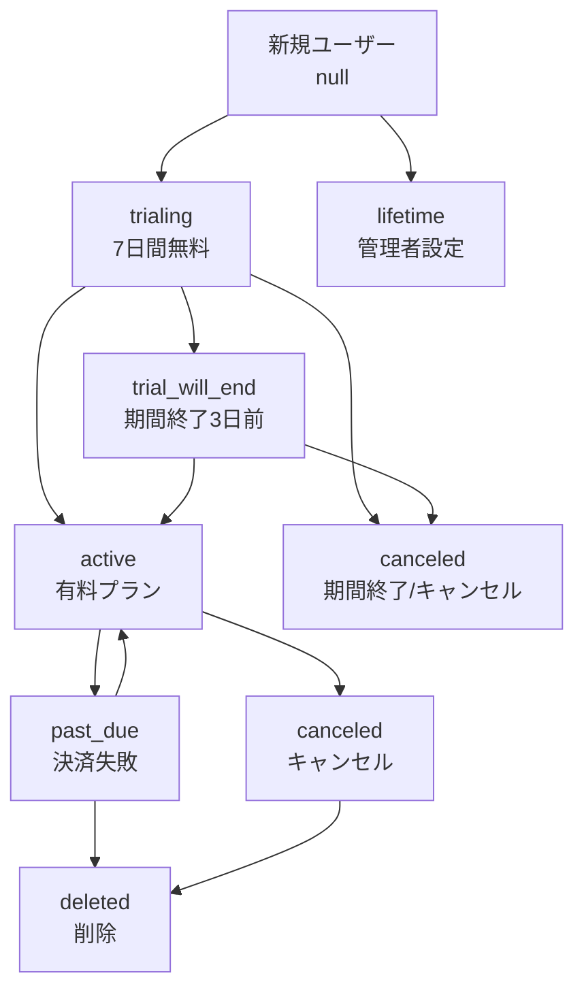

# サブスクリプションステータス 完全リファレンス

Learning Journalにおける`subscriptionStatus`フィールドの詳細説明と活用方法

---

## 概要

`subscriptionStatus`は、ユーザーのサブスクリプション状態を表す重要なフィールドです。このステータスによって、ユーザーが利用できる機能やプランが決定されます。

---

## ステータス一覧

### 1. `trialing` - トライアル期間中

#### 🎯 **意味**

- 7日間の無料トライアル期間中
- プロプラン機能をフル利用可能
- まだ決済は発生していない

#### 📅 **設定タイミング**

- Stripeチェックアウト完了時（`checkout.session.completed`）
- トライアル期間開始時

#### 🔧 **データベース状態**

```typescript
{
  subscriptionStatus: "trialing",
  subscriptionPlan: "pro",
  trialEnd: "2024-01-07T00:00:00.000Z",
  subscriptionEnd: "2024-01-07T00:00:00.000Z",
  cancelAtPeriodEnd: false,
  canceledAt: null
}
```

#### 🚀 **機能利用可否**

- ✅ AI機能（アドバイス・サジェスト）
- ✅ 学習ユニット無制限
- ✅ 学習ログ無制限
- ✅ 全プロプラン機能

#### 💻 **UI表示**

- プライシングページ: 「トライアル期間中（○月○日まで）」
- ダッシュボード: トライアルバナー表示
- 残り日数カウントダウン

#### 📧 **関連メール**

- 登録時: `sendTrialStartedWelcome()` - ウェルカムメール
- 3日前: `sendTrialEndingWarning()` - 期間終了警告

---

### 2. `active` - アクティブプラン

#### 🎯 **意味**

- 有料プロプランが有効
- 決済が正常に処理されている
- 全機能を継続利用可能

#### 📅 **設定タイミング**

- トライアル期間終了後の初回決済成功時
- 月次更新の決済成功時
- プラン復活時

#### 🔧 **データベース状態**

```typescript
{
  subscriptionStatus: "active",
  subscriptionPlan: "pro",
  subscriptionStart: "2024-01-07T00:00:00.000Z",
  subscriptionEnd: "2024-02-07T00:00:00.000Z",  // 次回更新日
  trialEnd: null,
  cancelAtPeriodEnd: false,
  canceledAt: null
}
```

#### 🚀 **機能利用可否**

- ✅ AI機能（アドバイス・サジェスト）
- ✅ 学習ユニット無制限
- ✅ 学習ログ無制限
- ✅ 全プロプラン機能

#### 💻 **UI表示**

- プライシングページ: 「プロプラン - 次回更新: ○月○日」
- 設定: 「プランを管理」ボタン表示

#### 📧 **関連メール**

- 決済成功時: `sendPaymentSucceededNotification()` - 決済完了通知

---

### 3. `canceled` - キャンセル済み

#### 🎯 **意味**

- サブスクリプションが終了済み
- 無料プランに戻っている
- AI機能は利用不可

#### 📅 **設定タイミング**

- 課金期間終了時（`cancel_at_period_end`が`true`の場合）
- トライアル期間終了時（キャンセル済みの場合）
- サブスクリプション削除時

#### 🔧 **データベース状態**

```typescript
{
  subscriptionStatus: "canceled",
  subscriptionPlan: null,              // 無料プランに戻る
  subscriptionStart: null,
  subscriptionEnd: null,
  trialEnd: null,
  cancelAtPeriodEnd: false,            // リセット
  canceledAt: null                     // リセット
}
```

#### 🚀 **機能利用可否**

- ❌ AI機能（利用不可）
- ✅ 学習ユニット無制限（基本機能）
- ✅ 学習ログ無制限（基本機能）
- ❌ プロプラン限定機能

#### 💻 **UI表示**

- プライシングページ: 「無料プラン」
- 「プロプランを始める」ボタン表示

#### 📧 **関連メール**

- 終了時: `sendSubscriptionCancelledNotification()` - 最終確認メール

---

### 4. `past_due` - 支払い遅延

#### 🎯 **意味**

- 決済に失敗している
- 一時的にサービス制限される可能性
- 支払い方法の更新が必要

#### 📅 **設定タイミング**

- 月次決済失敗時（`invoice.payment_failed`）
- 3回以上連続決済失敗時

#### 🔧 **データベース状態**

```typescript
{
  subscriptionStatus: "past_due",
  subscriptionPlan: "pro",             // プランは維持
  subscriptionStart: "2024-01-07T00:00:00.000Z",
  subscriptionEnd: "2024-02-07T00:00:00.000Z",
  cancelAtPeriodEnd: false,
  canceledAt: null
}
```

#### 🚀 **機能利用可否**

- ⚠️ AI機能（一時制限の可能性）
- ✅ 基本機能は継続利用可能
- ⚠️ プロプラン機能（制限される場合あり）

#### 💻 **UI表示**

- 警告バナー表示
- 「支払い方法を更新」ボタン
- 緊急性の高い通知

#### 📧 **関連メール**

- 決済失敗時: `sendPaymentFailedNotification()` - 支払い失敗通知

---

### 5. `deleted` - 削除済み

#### 🎯 **意味**

- Stripe側でサブスクリプションが完全削除
- 即座に無料プランに移行
- 復旧には新規登録が必要

#### 📅 **設定タイミング**

- Stripe管理画面でサブスクリプション削除時
- `customer.subscription.deleted` webhook受信時

#### 🔧 **データベース状態**

```typescript
{
  subscriptionStatus: "deleted",
  subscriptionPlan: null,
  subscriptionStart: null,
  subscriptionEnd: null,
  trialEnd: null,
  stripeSubscriptionId: null,          // Stripe情報もクリア
  stripePriceId: null
}
```

#### 🚀 **機能利用可否**

- ❌ AI機能（利用不可）
- ✅ 基本機能のみ利用可能

#### 💻 **UI表示**

- 「無料プラン」表示
- 新規サブスクリプション登録を促す

#### 📧 **関連メール**

- 削除時: `sendSubscriptionCancelledNotification()` - 削除確認メール

---

### 6. `trial_will_end` - トライアル終了予告

#### 🎯 **意味**

- トライアル期間の終了が近い（通常3日前）
- ユーザーに期間終了を事前通知
- 継続意思の確認が必要

#### 📅 **設定タイミング**

- `customer.subscription.trial_will_end` webhook受信時
- トライアル期間終了3日前

#### 🔧 **データベース状態**

```typescript
{
  subscriptionStatus: "trial_will_end",
  subscriptionPlan: "pro",             // プランは維持
  subscriptionStart: "2024-01-01T00:00:00.000Z",
  subscriptionEnd: "2024-01-07T00:00:00.000Z",
  trialEnd: "2024-01-07T00:00:00.000Z"
}
```

#### 🚀 **機能利用可否**

- ✅ AI機能（期間終了まで利用可能）
- ✅ 全プロプラン機能

#### 💻 **UI表示**

- 期間終了警告バナー
- 「あと○日でトライアル終了」
- 継続手続きへの誘導

#### 📧 **関連メール**

- 警告時: `sendTrialEndingWarning()` - 期間終了警告メール

---

### 7. `lifetime` - ライフタイムプラン

#### 🎯 **意味**

- 永続的なプロプラン
- 追加決済不要
- 管理者が手動で設定

#### 📅 **設定タイミング**

- 管理者による手動設定
- 特別キャンペーン時
- サポート対応時

#### 🔧 **データベース状態**

```typescript
{
  subscriptionStatus: "lifetime",
  subscriptionPlan: "pro",
  subscriptionStart: null,
  subscriptionEnd: null,              // 期限なし
  trialEnd: null,
  cancelAtPeriodEnd: false,
  canceledAt: null
}
```

#### 🚀 **機能利用可否**

- ✅ AI機能（永続利用可能）
- ✅ 全プロプラン機能
- ✅ 無期限利用

#### 💻 **UI表示**

- 「ライフタイムプロプラン」
- 特別なバッジ表示
- 管理機能なし（終了期限がないため）

---

## ステータス判定ロジック

### プラン取得関数（`getUserPlan`）

```typescript
export function getUserPlan(
  subscriptionStatus?: string | null,
  subscriptionPlan?: string | null
): PlanId {
  // ライフタイムプロプランの場合
  if (subscriptionStatus === "lifetime") {
    return "PRO";
  }

  // トライアル期間中は常にプロプラン
  if (subscriptionStatus === "trialing") {
    return "PRO";
  }

  // 通常のプロプラン
  if (subscriptionStatus === "active" && subscriptionPlan === "pro") {
    return "PRO";
  }

  return "FREE";
}
```

### アクティブ状態判定（`isActive`）

```typescript
const isActive =
  user.subscriptionStatus === "lifetime" ||
  (user.subscriptionStatus === "active" &&
    user.subscriptionEnd &&
    new Date(user.subscriptionEnd) > new Date()) ||
  (user.subscriptionStatus === "trialing" &&
    ((user.trialEnd && new Date(user.trialEnd) > new Date()) ||
      (user.subscriptionEnd && new Date(user.subscriptionEnd) > new Date())));
```

### AI機能利用可否判定（`canUseAIFeatures`）

```typescript
export async function canUseAIFeatures(userId: string): Promise<boolean> {
  const subscriptionInfo = await getUserSubscriptionInfo(userId);

  if (!subscriptionInfo) {
    return false;
  }

  // プロプランで有効な場合にAI機能を利用可能
  return subscriptionInfo.plan === "PRO" && subscriptionInfo.isActive === true;
}
```

---

## ステータス遷移図



---

## 実装における注意点

### 1. **ステータス判定の優先順位**

```typescript
// 判定順序（優先度高 → 低）
1. lifetime → 常にPROプラン
2. trialing → 期間中はPROプラン
3. active + pro → PROプラン
4. その他 → FREEプラン
```

### 2. **期間終了判定の重要性**

```typescript
// 期間が過ぎていても、ステータスが"active"の場合があるため
// 期間との組み合わせで判定が必要
const isActive =
  status === "active" &&
  subscriptionEnd &&
  new Date(subscriptionEnd) > new Date();
```

### 3. **キャンセル予約状態の処理**

```typescript
// cancel_at_period_endがtrueでも、期間終了まではアクティブ
const willCancelAtPeriodEnd =
  cancelAtPeriodEnd &&
  subscriptionEnd &&
  new Date(subscriptionEnd) > new Date();
```

### 4. **UI表示の一貫性**

- ステータスに関わらず、期間情報も必ず確認
- ユーザーに分かりやすい表現で状態を伝える
- 緊急性に応じた色分けやアイコンの使用

---

## トラブルシューティング

### よくある問題

1. **ステータスが更新されない**

   - Webhook処理の失敗を確認
   - 手動同期API（`/api/sync-subscription`）を実行

2. **期間終了後もアクティブ**

   - 期間とステータスの組み合わせ判定を確認
   - Stripeとデータベースの同期状態を確認

3. **AI機能が使えない**
   - `canUseAIFeatures`の判定ロジックを確認
   - プランとアクティブ状態の両方を確認

### デバッグ手順

1. データベース状態確認

   ```sql
   SELECT subscriptionStatus, subscriptionPlan, subscriptionEnd, cancelAtPeriodEnd
   FROM User WHERE email = 'user@example.com';
   ```

2. Stripe状態確認

   - `/api/debug-subscription`で比較

3. 手動同期実行
   - `/api/sync-subscription`でStripeから同期

---

このドキュメントは、サブスクリプションステータスの理解と実装において、開発チームの重要なリファレンスとして活用してください。
